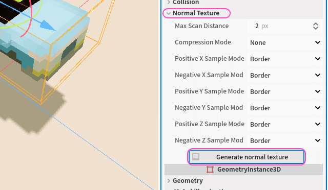

 

# &nbsp;&nbsp;XDUT Stacked Sprite 3D

3D 空間にスプライトスタックを描画するためのアドオンです。

 

## インストール

#### デモを確認する

1. `git clone https://github.com/ydipeepo/xdut-stacked-sprite-3d.git` もしくは、[ダウンロード](https://github.com/ydipeepo/xdut-stacked-sprite-3d/releases)し、
2. プロジェクトを開いて実行します。

#### アドオンを追加する

1. `git clone https://github.com/ydipeepo/xdut-stacked-sprite-3d.git` もしくは、[ダウンロード](https://github.com/ydipeepo/xdut-stacked-sprite-3d/releases)し、
2. `addons/xdut-stacked-sprite-3d` をプロジェクトにコピーし、
3. プロジェクト設定から XDUT Stacked Sprite 3D を有効にします。

 

## 使い方

アドオンを有効化すると `StackedSprite3D` ノード、`StackedSpriteMesh` リソースが有効になります。

#### スプライトスタックボリュームの配置

以下の 2 種類の方法でシーンに配置できます。

* `StackedSprite3D` ノードを配置する
* `MeshInstance3D` もしくは `MultiMeshInstance3D` に `StackedSpriteMesh` リソースを設定する

ここでは `StackedSprite3D` ノードを使います:

#### ディフューズの設定

ディフューズテクスチャ (`albedo_texture` プロパティ) を設定し、垂直分割数 (`frames` プロパティ) を設定します:

> [!NOTE]
> ここでのディフューズテクスチャとは、 
> 以下のようなスプライトを横方向に等間隔に並べた 2D テクスチャです。
>
> 
>
> 左側のスプライトから Y+ 方向に重ねて描画されます。 
> アドオンはこのテクスチャを `frames` プロパティで指定した枚数に分割し、 
> スプライトスタックボリュームとして扱います。

この時点でボリュームが描画されるようになります。

#### 法線の設定 (任意)

法線テクスチャ (`normal_texture` プロパティ) を設定もしくは生成します。ここでは自動生成します。 
Normal Texture グループを開き、Generate normal texture ボタンをクリックします:

> [!NOTE]
> 法線テクスチャは、UVW ボリュームアドレスがディフューズテクスチャのものと一致します。 
> ピクセル RGB 各色は、法線ベクトル XYZ にそれぞれマッピングされます。 
> RGB 各成分 0 ~ 255 の値は、法線ベクトル各成分 -1.0 ~ +1.0 に対応し、 
> このベクトルはシェーダー内部で正規化されます。

> [!NOTE]
> タイルボリュームなどで用いる場合 (他のボリュームと接触する境界を含む場合)、XYZ 各軸のサンプラを変更します。
>
> | サンプラ | 説明 |
> |---|---|
> | Border | 範囲外のアドレスをボリュームが存在しないものとして扱います。(デフォルト) |
> | Clamp | 範囲外のアドレスを 0.0 ~ 1.0 の範囲に制限します。 |
> | Repeat | 範囲外のアドレスを接合点で繰り返します。 |
> | Mirror | 範囲外のアドレスを接合点でミラーリングします。 |

> [!CAUTION]
> 最大スキャンピクセル距離 (`max_scan_distance` プロパティ) を大きくし過ぎると生成に時間がかかることがあります。 

#### マテリアルの設定 (任意)

マテリアルを設定するには、法線テクスチャが設定されている必要があります。 
マテリアルグループを開き、各プロパティを設定します。

> [!NOTE]
> `emission_texture`、`specular_texture`、`metallic_texture` はそれぞれ各ピクセルの R 成分のみを読み込みます。 
> R 成分 0 ~ 255 の値は、0.0 ~ 1.0 に対応します。

 

## ライセンス

🔗 [MIT](https://github.com/ydipeepo/xdut-stacked-sprite-3d/blob/main/LICENSE) ライセンスです。

#### 表記

ライセンスの表記は必須ではありませんが、歓迎いたします。クレジットする場合は、"Ydi" に帰属させてください。

 
